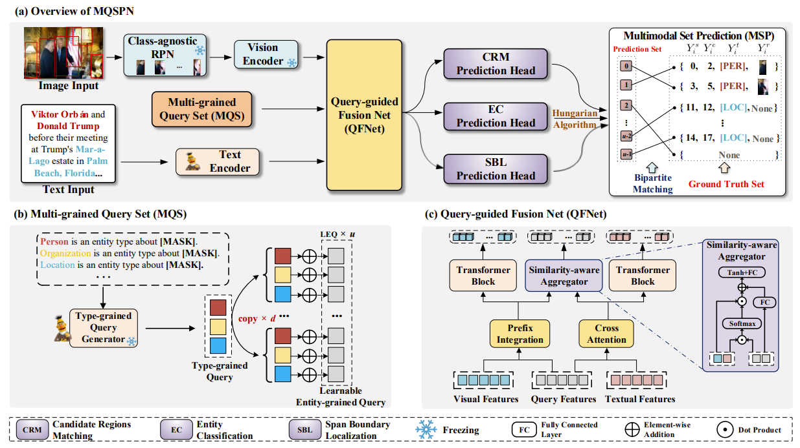

# MQSPN

Code for the paper: "**Multi-Grained Query-Guided Set Prediction Network for Grounded Multimodal Named Entity Recognition**." ([Paper Link](https://arxiv.org/abs/2407.21033)).

## Overview



### Requirements 
- python 3.8

- pytorch 1.9.1

- transformers 4.11.3

We suggest utilizing the conda environment. Please make sure you have enough GPU memory no less than 24GB.
```bash
conda create -n mqspn python=3.8
conda activate mqspn
pip install -r requirements.txt
```
### Datasets

We use publicly released datasets [Twitter-GMNER](https://github.com/NUSTM/GMNER) and  [Twitter-FMNERG](https://github.com/NUSTM/GMNER) to train and evaluate our proposed model. You can find datasets' detailed information from their original papers:


  - The preprocessed CoNLL format files are provided in this repo data file. For each tweet, the first line is its image id, and the following lines are its textual contents.
  - Download each tweet's associated images via this [link](https://drive.google.com/file/d/1PpvvncnQkgDNeBMKVgG2zFYuRhbL873g/view). 
  - Following  [H-Index](https://github.com/NUSTM/GMNER/tree/main) , we utilize open-sourced [VinVL](https://github.com/pzzhang/VinVL) as class-agnostic RPN to identify all the candidate regions. To make MQSPN training efficient, we execute it in an individual process and store pre-detection results under the folder named "Vinvl_detection_path". The features and regions extracted by VinVL can be found at [this](https://drive.google.com/drive/folders/1w7W4YYeIE6bK2lAfqRtuwxH-tNqAytiK).
  - Please place the corresponding files as the following structure in the data file:

```bash
|----datasets\
    |----images_annotation # annotation xml file here
    |----Vinvl_detection_path # candidate regions for twitter15 and twitter17 here
    |----twitterGMNER # original raw text with BIO annotations 
    |    |----twitter10k_types.json
    |    |----dev.txt
    |    |----samples.txt
    |    |----train.txt
    |    |----test.txt
    |----twitterFMNERG # original raw text with BIO annotations
    |    |----twitter10k_types.json
    |    |----dev.txt
    |    |----samples.txt
    |    |----train.txt
    |    |----test.txt
    |----raw_images # all twitter15 and twitter17 raw images here

```

## Usage

### Train for MQSPN
- For TwitterGMNER dataset:
```bash
python run.py train --config configs/twitterGMNER.conf
```
- For TwitterFMNERG dataset:
```bash
python run.py train --config configs/twitterFMNERG.conf
```
### Evaluation 
- For TwitterGMNER dataset:
```bash
python run.py eval --config configs/twitterGMNER_eval.conf
```
- For TwitterFMNERG dataset:
```bash
python run.py eval --config configs/twitterFMNERG_eval.conf
```
## Acknowledgements

The datasets we used are from  [Yu et al.](https://github.com/NUSTM/GMNER/tree/main) and  [Wang et al.](https://github.com/NUSTM/FMNERG). Some codes are based on the open-sourced codes  [PIQN](https://github.com/tricktreat/piqn) and  [MKGFormer](https://github.com/zjunlp/MKGformer). Thanks for their great works!

## Citation
```bibtex
@article{tang2024mqspn,
  title={Multi-Grained Query-Guided Set Prediction Network for Grounded Multimodal Named Entity Recognition},
  author={Tang, Jielong and Wang, Zhenxing and Gong, Ziyang and Yu, Jianxing and Wang, Shuang and Yin, Jian},
  journal={arXiv preprint arXiv:2407.21033},
  year={2024}
}
```
